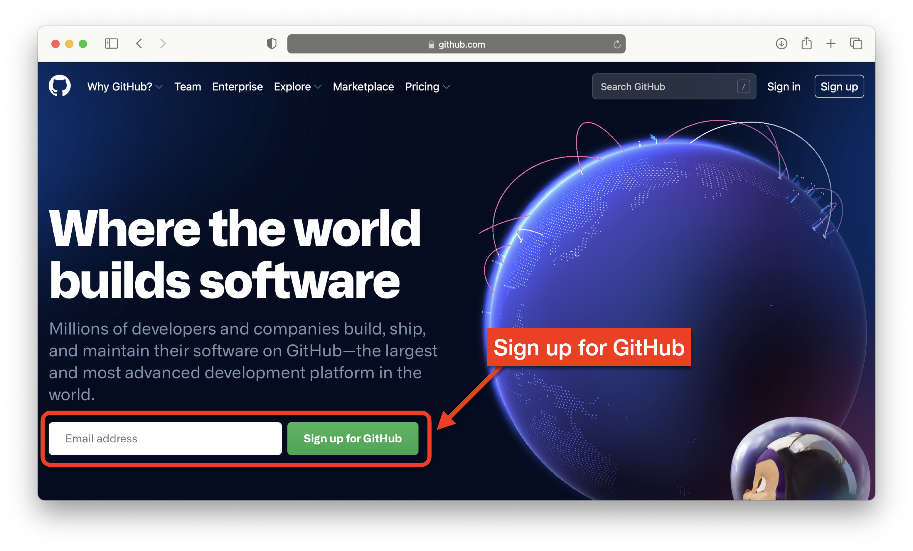
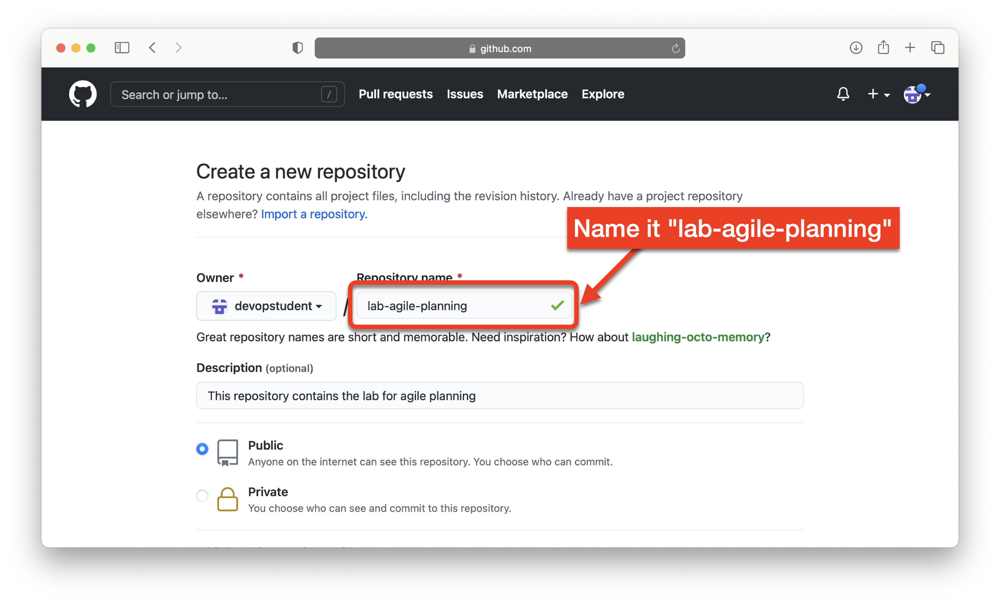
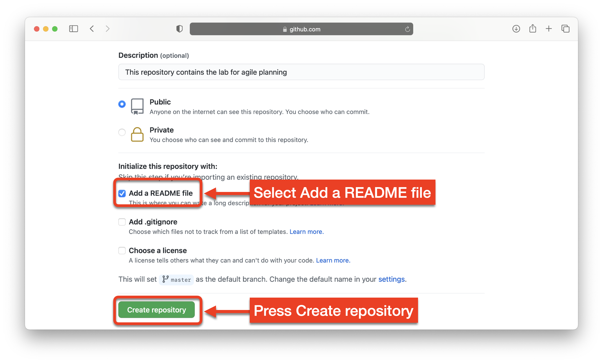
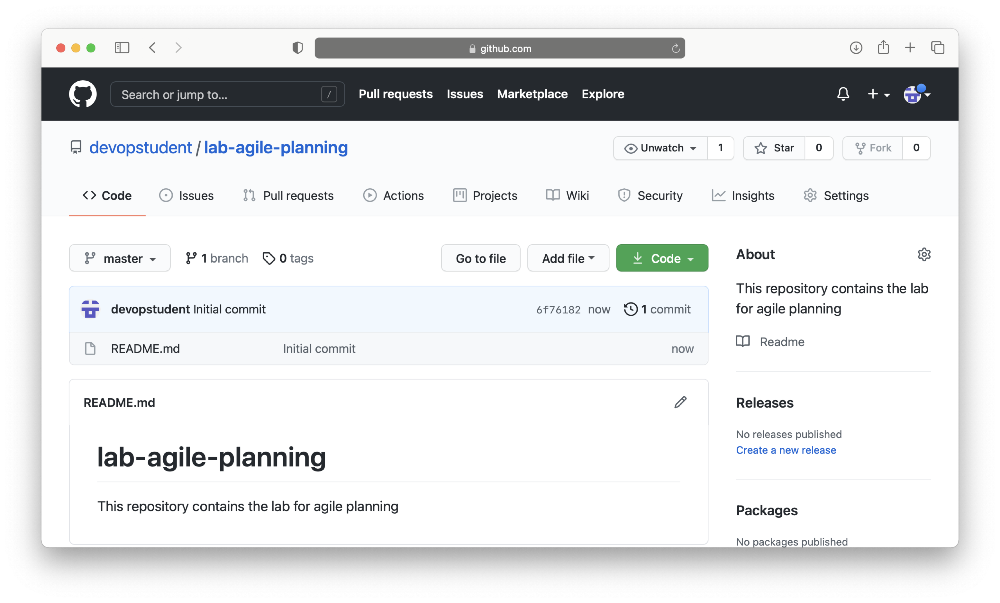
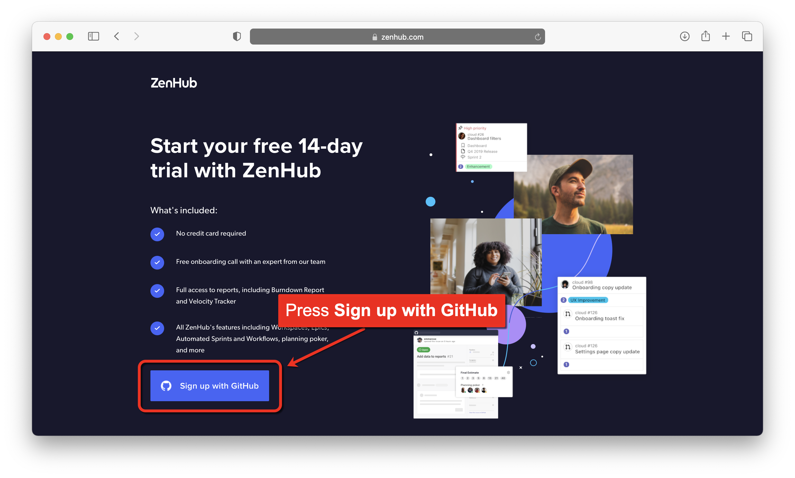
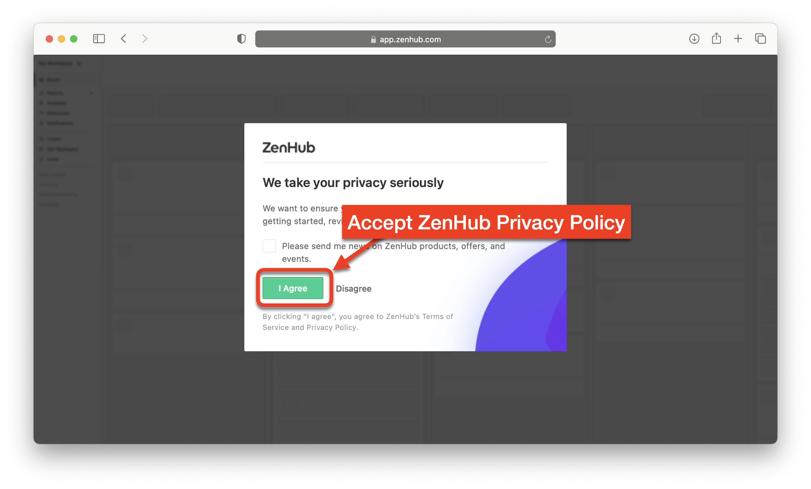
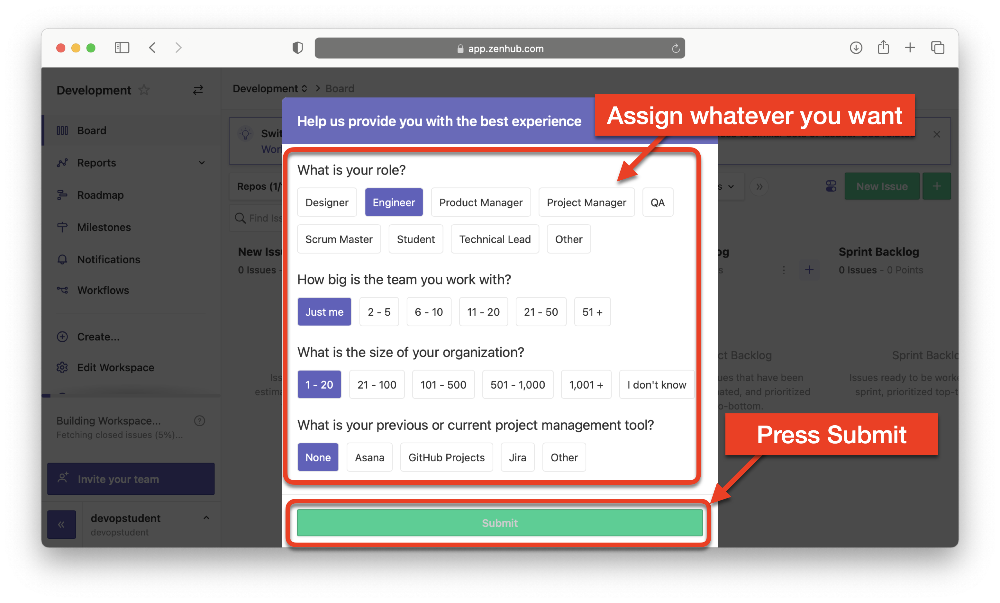
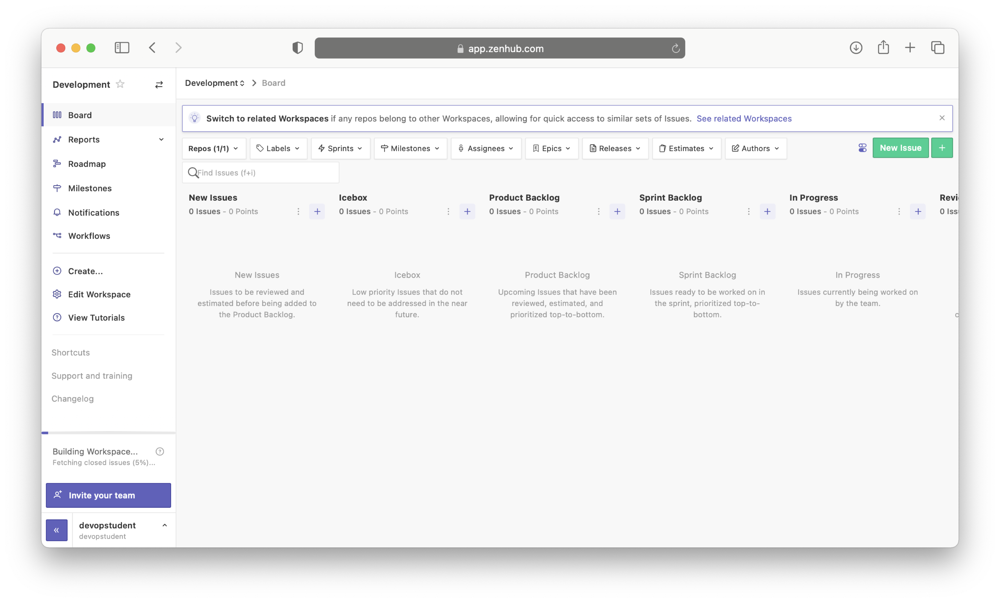

# Lab 1: Get set up in ZenHub

**Estimated time needed:** 20 minutes

In this lab, you will prepare for the labs that follow by setting up a free GitHub account and a free ZenHub account.

## Objectives

After completing this lab, you will be able to:

1. Create a free GitHub account.
1. Create a GitHub repository.
1. Create a free ZenHub account.
1. Install the optional browser extension for ZenHub.

## Exercise 1 : Create a free GitHub account

In this exercise, you will create a free GitHub account, if you don't already have one. ZenHub requires GitHub so this first step is a prerequisite to getting a ZenHub account.

1. Go to [GitHub.com](http://github.com) and sign up for a free GitHub account.

1. Enter your email address and press the **Sign up for GitHub** button. If you have an account, press the **Sign in** button and login.

    

## Exercise 2 : Create a GitHub repository

In this exercise, you will create a repository to hold the issues and kanban board for your plan.

1. If you just created your GitHub account, create your first repository by pressing the **Create repository** button, then go to step **3**.
    

1. If you already have a GitHub account, sign into GitHub and on your account page, press the **New** repository button.
    

1. Name your repository **lab-agile-planning** and give it a good description like: _This repository contains the lab for agile planning_ and make sure the **Public** option is selected.
    

1. Scroll down on that page and select **Add a README file** and then press the **Create repository** button to create the new repository.
    

You should now have a new repository called **lab-agile-planning** that we will use with ZenHub. It should look similar to the screenshot below:
    

## Exercise 3 : Create free ZenHub account

In this exercise, you will create a free ZenHub account to use with GitHub. ZenHub is an application that integrates with GitHub. In order to use it, you must sign up for a free account.

1. Go to www.zenhub.com and press the [Try for free](https://www.zenhub.com/sign-up) button. Even though it says "*Start your free 14-day trial with ZenHub*" you can continue to use ZenHub for free on open source projects.
    

1. On the next page, press the **Sign up with GitHub** button.
    

1. On the next page, press the **Sign in with GitHub** button.
    

1. Since you are already signed into GitHub from the previous steps, you should be presented with a page that will allow you to authorize ZenHubIO to access your GitHub account.
    

1. (optional) If you are not signed into GitHub, you will be prompted to sign in to GitHub. That will bring you to a page where you must use your GitHub credentials.
    

1. If you have two-factor authentication enabled on your GitHub account, you must enter your authorization code now.
    

1. Accept ZenHub's privacy policy
    

1. Assign the name "**Development**" to your new ZenHub workspace.
    

1. Enter whatever you want for this ZenHub survey and press **Submit**
    

1. This will place you in your kanban board for the `lab-agile-planning` repository.
    

## Exercise 4 : (Optional) Browser extension for Chrome or Firefox

In this optional exercise, you will download a browser extension for ZenHub.

If you use Chrome or Firefox, you can download a browser extension for ZenHub that will add a ZenHub tab while you are using GitHub so that you don't have to go to zenhub.com to view your kanban board.

1. Download a browser extension for ZenHub here: [www.zenhub.com/extension](https://www.zenhub.com/extension). Once installed, it will add a ZenHub tab while you are using GitHub. This is purely a convenience. The capabilities of both the browser extension and the web zenhub.com site are the same.

## Summary

Congratulations! You are now set up with a ZenHub account and GitHub account so that you can work through the rest of the labs.
