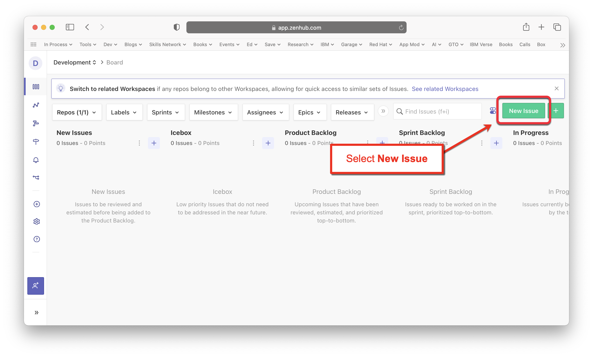
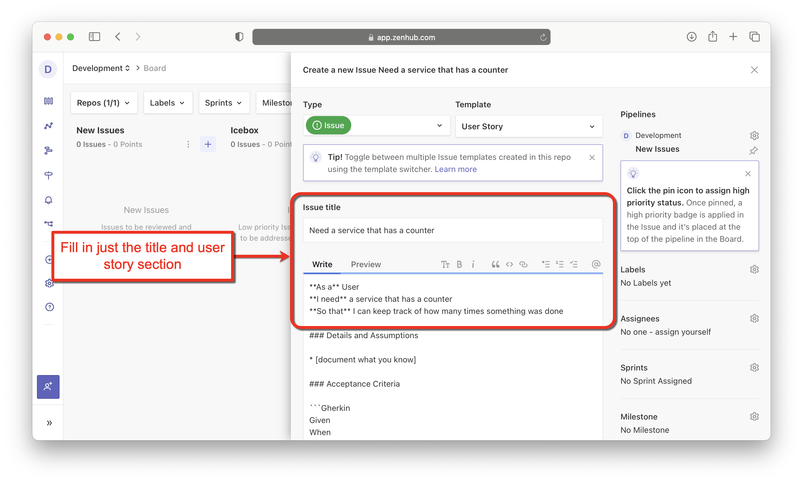
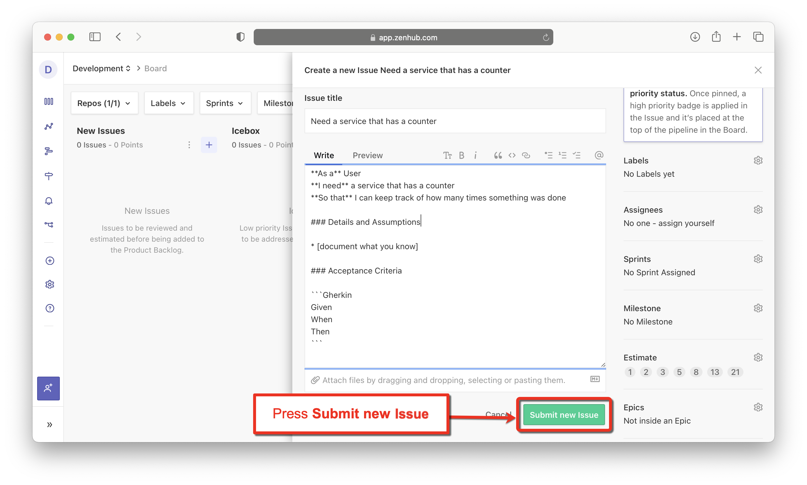
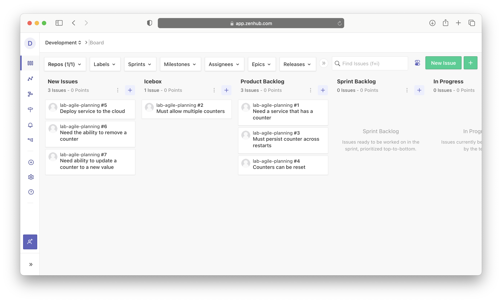

# Lab 3: Assemble your Product Backlog

**Estimated time needed:** 15 minutes

In this lab, you will create seven user stories based on the requirements given. The first four will be given to you so that you can just cut and paste to get familiar with ZenHub. The last three you will need to create by yourself. You will then prioritize these stories and move them into the appropriate pipelines on your kanban board.

## Objectives

After completing this lab, you will be able to:

1. Create new user stories using GitHub issues.
1. Prioritize the product backlog.

---

## Exercise 1 : Create new user stories using GitHub issues

In this exercise, you will create the following user stories using ZenHub:

**Stories from the Lesson:**

Title: Need a service that has a counter

- As a User, I need a service that has a counter, So that I can keep track of how many times something was done.

Title: Must allow multiple counters

- As a User, I need to have multiple counters, So that I can keep track of several counts at once.

Title: Must persist counter across restarts

- As a Service Provider, I need the service to persist the last known count, So that users don't lose track of their counts after the service is restarted.

Title: Counters can be reset

- As a System Administrator, I need the ability to reset the counter, So that I can redo counting from the start.

**New Requirements:**

- Deploy service to the cloud.
- Need the ability to remove a counter.
- Need the ability to update a counter to a new value.

You will use ZenHub to enter these stories as issues in GitHub using the template that you created in [Lab 2](../lab_2/lab2-create-story-template.md).

1. Goto [app.zenhub.com](http://app.zenhub.com) and sign in with your GitHub account.
    

1. From your kanban board view, select **New Issue**.
    

1. From the **Template** dropdown, select **User Story**.
    

1. Enter the title for the first story **Need a service that has a counter** and fill out just the user story section (i.e., As a, I need, So that) for now.
    

1. Scroll to the bottom of the page and press **Submit new Issue**.
    

1. Press the **X** icon in the upper right corner to close the new issue. Note that it now shows up in your **New Issues** pipeline.
    

1. Continue adding stories until all seven stories are created and your kanban board looks like this. Note that the first four stories are given to you from the lesson. You will need to create your own role, function, and benefit for the last three stories.
    

---

## Exercise 2 : Prioritize the product backlog

In this exercise, you will move issues between pipelines to recreate the kanban board from the video lesson **Building the Product Backlog**. This will simulate an initial starting point for our next lab on backlog refinement. Please note that you can move the issues between pipelines by simply dragging and dropping them from one pipeline to teh other.

1. Move the **Need a service that has a counter** story to the top of the **Product Backlog** pipeline.

1. Move the **Must allow multiple counters** story to the **Icebox** pipeline.

1. Move the **Must persist counter across restarts** story to the bottom of the **Product Backlog** pipeline.

1. Move the **Counters can be reset** story to the bottom of the **Product Backlog** pipeline.

1. Leave the remaining stories in the **New Issues** pipeline for now. We will move them in a later lab.

At the completion of this exercise, your kanban board should look like this:

## Summary

You learned how to create new stories in ZenHub using Issues in GitHub and a User Story template. You also learned how to quickly prioritize your product backlog. You now have enough stories in your repository to start planning with ZenHub.
