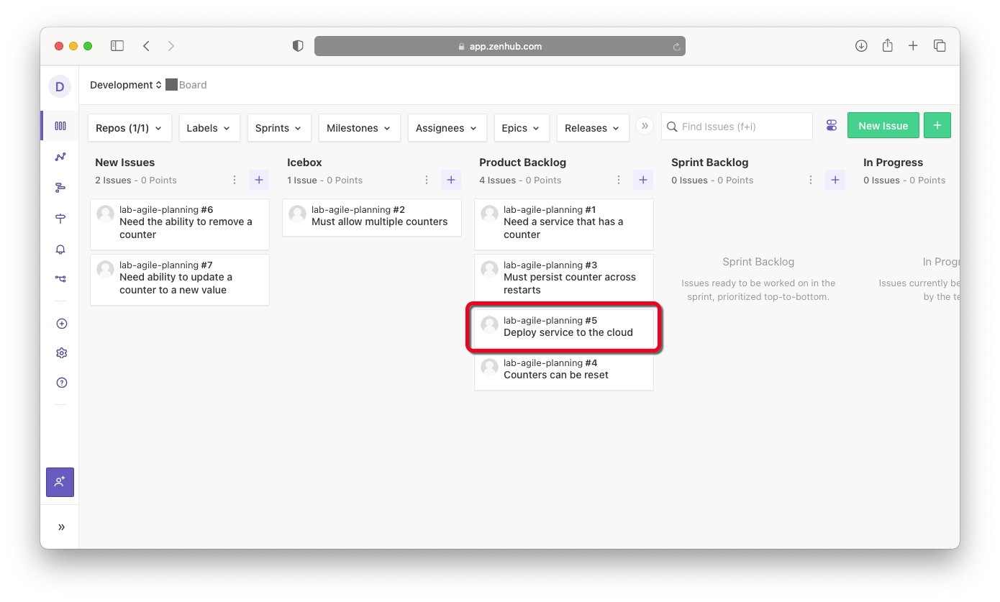
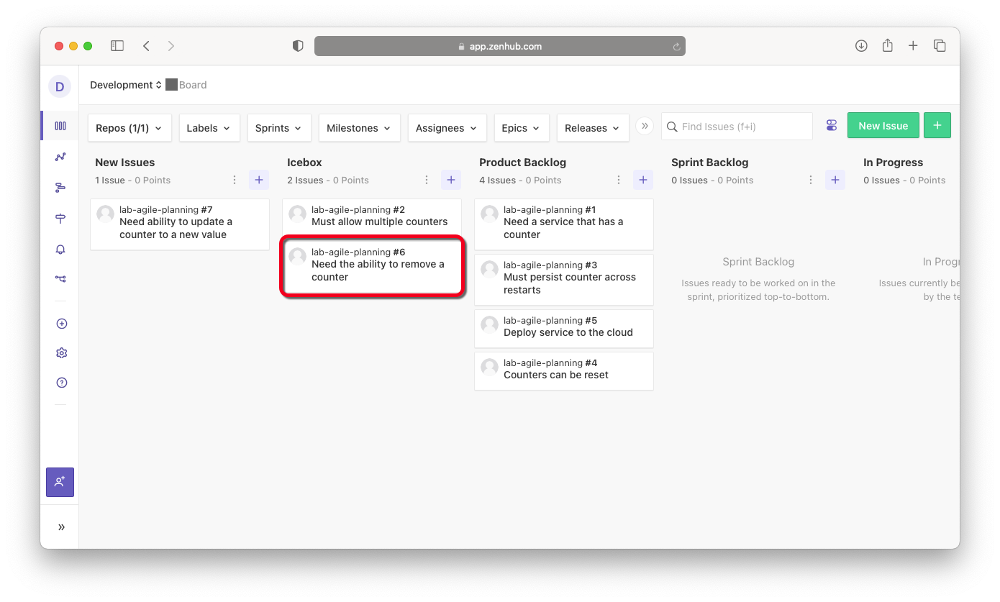
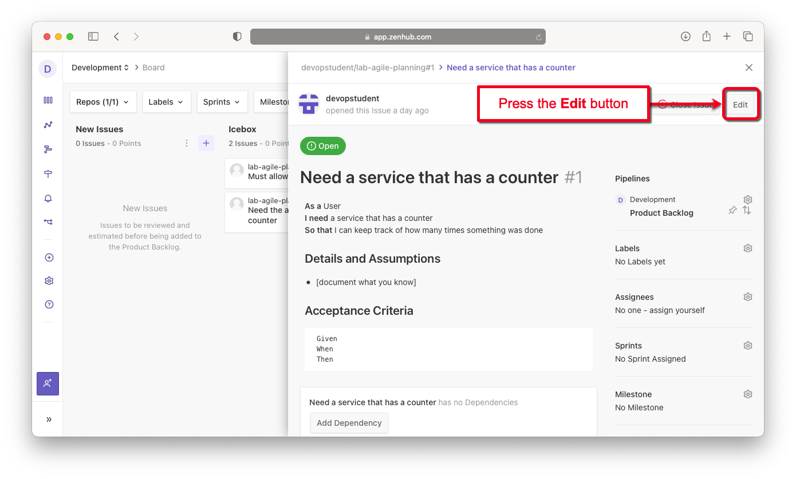
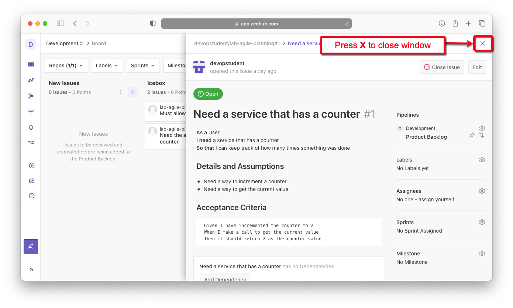
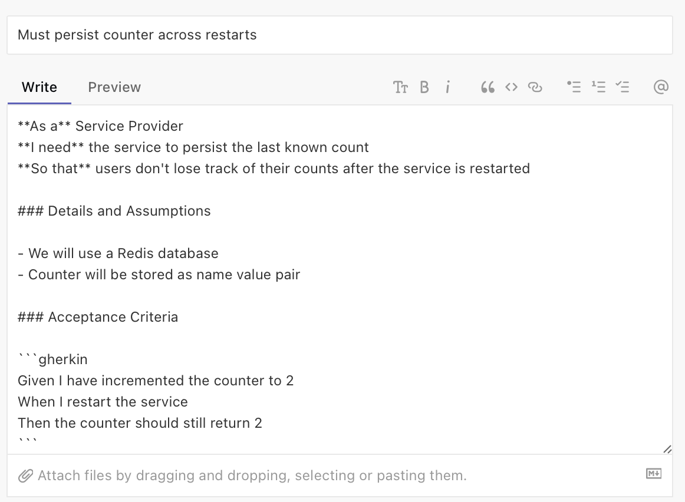
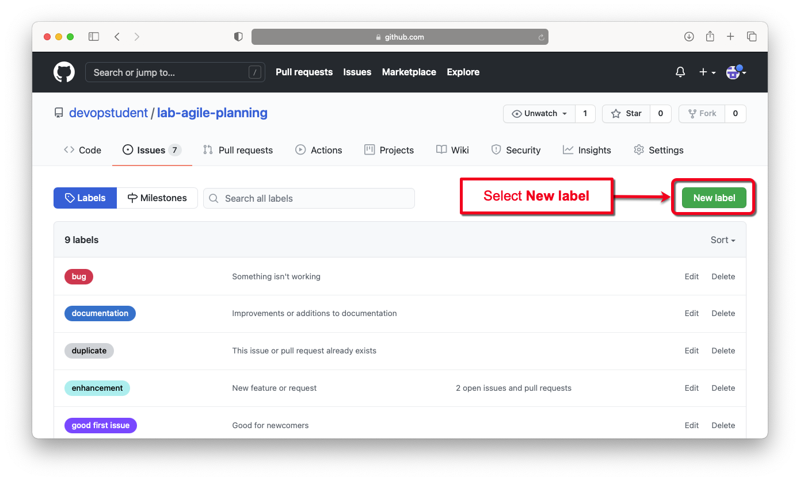
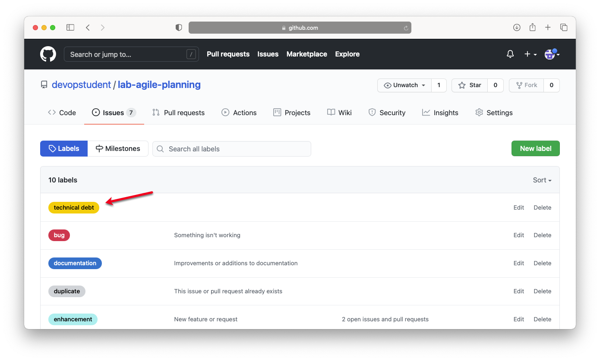
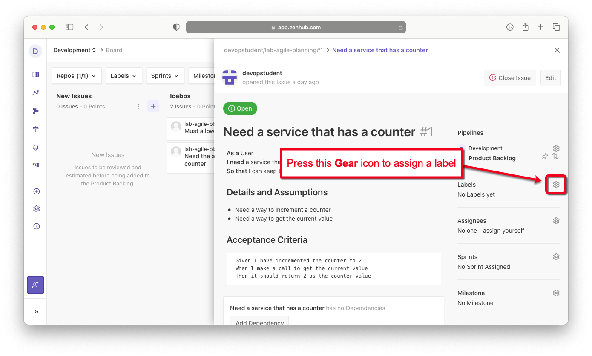
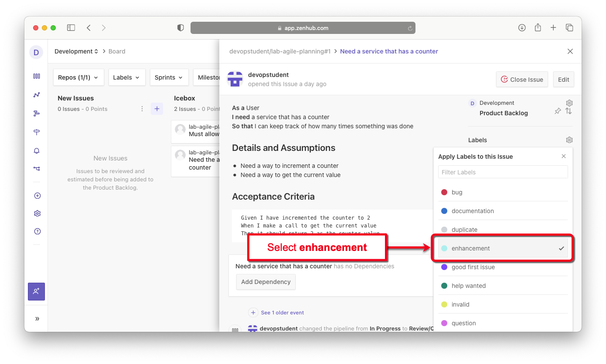

# Lab 4: Refine your Product Backlog

**Estimated time needed:** 20 minutes

In this lab, you will follow the steps of conducting a backlog refinement meeting. You will be the product owner getting the product backlog ready for your next sprint planning meeting. This involves grooming the stories we created in the last lab to make them *sprint ready*.

## Objectives

After completing this lab, you will be able to:

1. Triage new issues.
1. Make stories sprint ready.
1. Create new labels in GitHub.
1. Add labels to stories.

---

## Initial State

At the completion of [Lab 3](../lab_3/lab3-assemble-product-backlog.md), your kanban board should look like this:

**New Issues:**

- Deploy service to the cloud
- Need the ability to remove a counter
- Need ability to update a counter to a new value

**Icebox:**

- Must allow multiple counters

**Product Backlog:**

- Need a service that has a counter
- Must persist counter across restarts
- Counters can be reset

---

## Exercise 1 : Triage new issues

In this exercise, you will take all of the stories in the **New Issues** pipeline and move them to an appropriate pipeline or reject them.

1. Go to [app.zenhub.com](http://app.zenhub.com) and sign in with your GitHub account and bring up your kanban board.
    

1. The first new issue is **Deploy service to the cloud**. We want to do that after adding persistence, so move that to the **Product Backlog** pipeline under **Must persist counter across restarts**.
    

1. The next new issue is **Need the ability to remove a counter**. We only have one counter and we wouldn't want to remove that, so let's move that to the **Icebox** after  **Must allow multiple counters**.
    

1. The last new issue is **Need ability to update a counter to a new value**. We might want to do that as an enhancement after we can reset the counter, so let's move that to the **Product Backlog** after **Counters can be reset**.
    

You have now completed new issue triage and can start making the stories in the **Product Backlog** pipeline sprint ready.

---

## Exercise 2 : Make stories sprint ready

In this exercise, you will add more details to the stories in the **Product Backlog** that you feel might make it into the next sprint. You will be provided with the details for two of the stories. You must provide the details for the other three.

1. Select the first story at the top of the **Product Backlog** pipeline to open it. Then press the **Edit** button to edit the issue.
    

1. Edit the **Details and Assumptions** to let developers know what we know, and edit the **Acceptance Criteria** to make sure that everyone understands what the definition of "*done*" is. Make your story look like this one:  
    

1. When you are finished editing, press the **Update** button to save the edits.
    

1. Close the window by pressing the **X** icon.
    

1. Edit the **Must persist counter across restarts** story in the same way and make it look like the following:
    

1. Edit the **Deploy service to the cloud** story and make up your own **Details and Assumptions**, and **Acceptance Criteria**.

1. Edit the **Counters can be reset** story and make up your own details, assumptions, and acceptance criteria.

1. Edit the **Need ability to update a counter to a new value** story and make up your own details, assumptions, and acceptance criteria.

At the completion of this exercise, your kanban board should have sufficient details in all of the stories in the **Product Backlog** to make them sprint ready.

---

## Exercise 3 : Create new labels in GitHub

In this exercise, you will create a new label in GitHub called `technical debt` to flag those stories that provide no visible customer value but must be completed in order to continue development.

1. Go to [github.com](http://www.github.com) and select your **lab-agile-planning** repository.
    

1. From your repository page, select the **Issues** tab.
    

1. From the issues page, select the **Labels** button.
    

1. From the labels page, select the **New label** button.
    

1. In the new label section: (1) set the **Label name** to `technical debt`, (2) set the **Color** to `yellow` (`#FBCA04`), then (3) press the **Create label** button.
    

1. You should now see a yellow `technical debt` label that we can use to annotate our stories.
    

---

## Exercise 4 : Add labels to stories

In this exercise, you will go back to ZenHub and add labels to the stories in the **Product Backlog** to further make them sprint ready. You will also use our new label called `technical debt` to flag those stories that provide no visible customer value but must be completed to continue development.

1. Go to ZenHub and select the first story at the top of the **Product Backlog** pipeline to open it. Then press the **Gear** icon next to **Labels** to assign a label.
    

1. Our first story is an enhancement to our product. From the label menu, select **enhancement** to reflect this.
    

1. Click anywhere off of the labels menu to close it. You should now see that the label **enhancement** has been assigned to this story.
    

1. Select each of the following stories in the **Product Backlog** pipeline and assign them the corresponding labels.

    | Story Title | Label |
    |-------|-------|
    | Must persist counter across restarts | enhancement |
    | Deploy service to the cloud | technical debt |
    | Counters can be reset | enhancement |
    | Need ability to update a counter to new value | enhancement |

At the end of this exercise, your kanban board should look like this:

## Summary

You learned how to triage new issues, add detail to stories to make them sprint ready, create new labels, and assign labels to stories in preparation for a sprint planning meeting.
