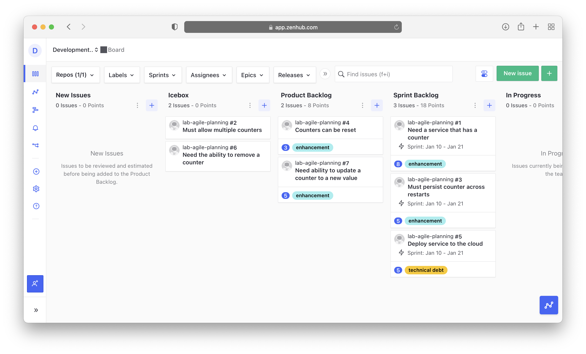
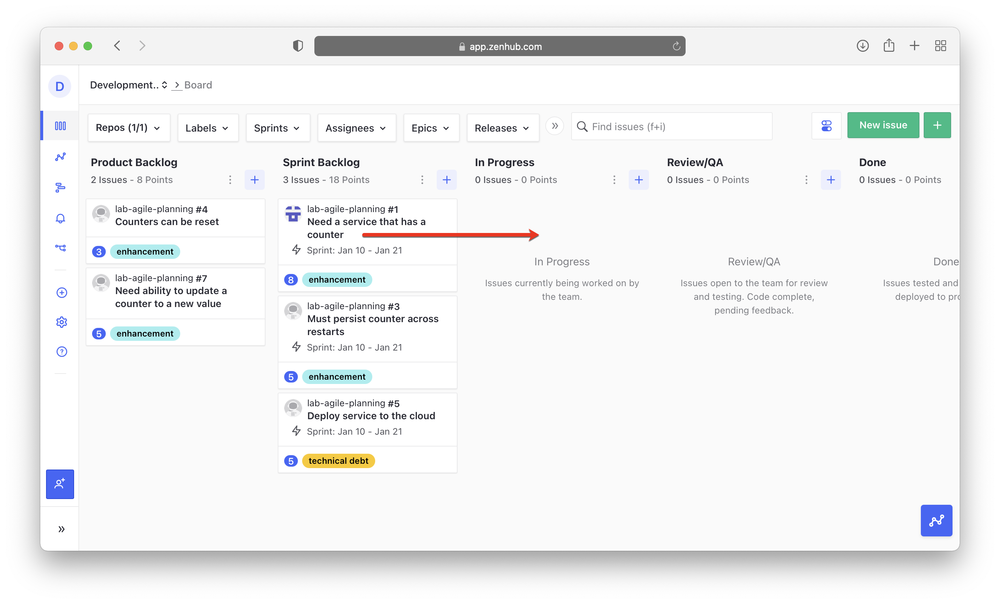
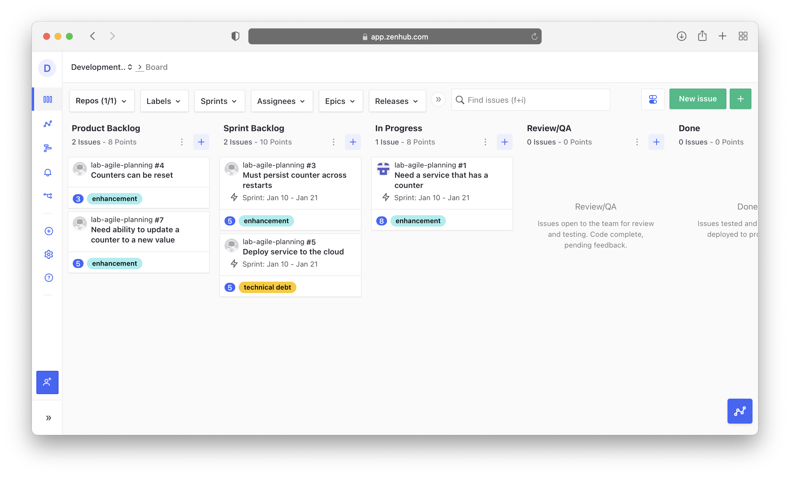
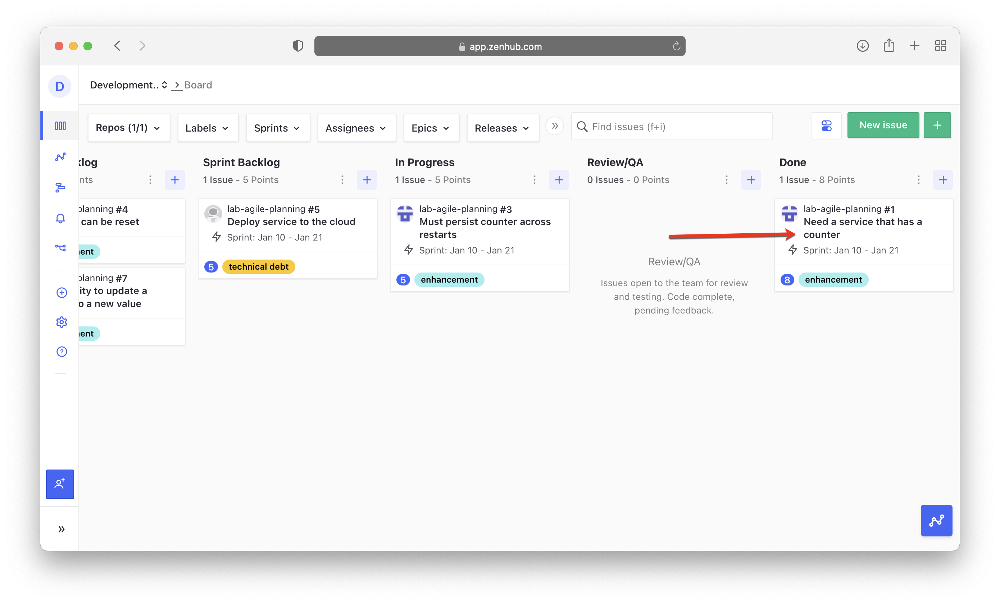
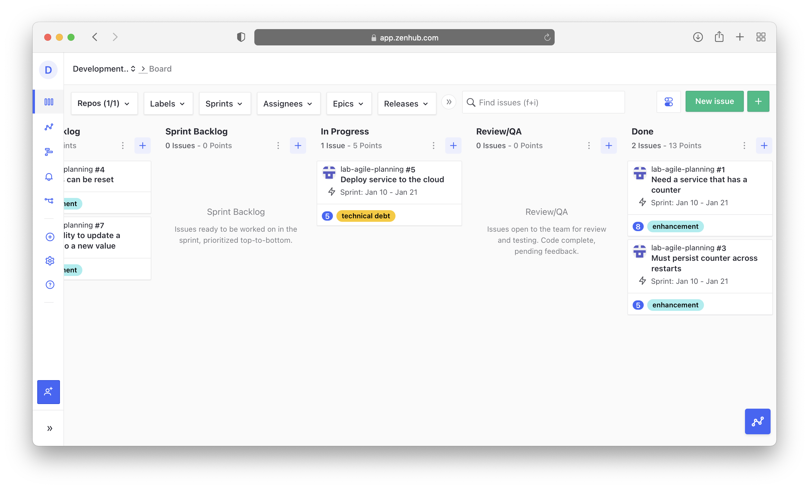

# Lab 6: Move stories from In Progress to Done

**Estimated time needed:** 10 minutes

In this lab, you will follow the daily workflow of moving stories from the sprint backlog to the In Progress pipeline, assigning them to yourself to work on them, moving them to Review/QA, and moving them to the Done pipeline.

## Objectives

After completing this lab, you will be able to:

1. Assign stories to yourself.
1. Move stories to **In Progress** to work on them.
1. Move stories to **Review/QA** for team review.
1. Move stories to **Done** once they are completed.

## Initial State

After completing the sprint planning lab, your kanban board should look like this:

**New Issues:**

- None

**Icebox:**

- Must allow multiple counters
- Need the ability to remove a counter

**Product Backlog:**

- Counters can be reset
- Need ability to update a counter to a new value

**Sprint Backlog:**

- Need a service that has a counter
- Must persist counter across restarts
- Deploy service to the cloud

---

## Exercise 1 : Daily Workflow

In this exercise, you will simulate the daily workflow of a developer on an Agile team. You will start by moving a story from the top of the **Sprint Backlog** to the **In Progress** pipeline and assign it to yourself. Then you will simulate completing the story, asking for a review, and finally moving it to done.

1. Go to [app.zenhub.com](http://app.zenhub.com) and sign in with your GitHub account and bring up your kanban board.
    

1. The sprint has started and you are ready to work on your first story. Select the story at the top of the **Sprint Backlog** to open it and read it.
    

1. After reading it, you decide that this is something you have the skills to work on, so you assign it to yourself.
    

1. Once assigned, press the **X** to close the window.
    

1. Back at the kanban board, move the story you just assigned to yourself from the **Sprint Backlog** by dragging it to the **In Progress** pipeline.
    

1. Everyone now knows that you are working on this story. You would normally create a branch in GitHub to start working on your code. For this lab, just make sure that your kanban board looks like the one below. (*Note: Your avatar may look different.*)
    

1. Once you finish working on the story, it's time to request a review. It's always a good idea to get two sets of eyes on all work products. If you checked code into GitHub, this is the step where you would make a pull request to merge your code into the `master` branch. Move your story from **In Progress** to **Review/QA**.
    

1. While you are waiting for a review, you decide to start working on another story. Take the next story off of the top of the **Sprint Backlog**, read it to make sure that you have the skills to implement it, (*Hint: You do.*) assign it to yourself, and move it to **In Progress**.
    

1. Your pull request on your initial story has been approved and the review process is complete. Move the story "*Need a service that has a counter*" from the **Review/QA** pipeline to the **Done** pipeline.
    

1. You have completed work on your second story and made another pull request. Move the story "*Must persist counter across restarts*" from **In Progress** to **Review/QA** to request a review.
    

1. Take the last story, "*Deploy service to the cloud*", off of the top of the **Sprint Backlog**, assign it to yourself, and move it to **In Progress**.
    

1. The review of your second story is complete. Move the story "*Must persist counter across restarts*" from **Review/QA** to **Done**.
    

1. The sprint has ended and we have run out of time to complete our last story, "*Deploy service to the cloud*", which is still in progress. We will see how to deal with this in a future lab. Leave it where it is for now.

The finished kanban board for this lab should look like this:

## Summary

You learned how to assign stories to yourself, and move the story to **In Progress** to work on it. You also learned how to move stories to **Review/QA** to request a team review, and to move stories to **Done** once they are completed.
