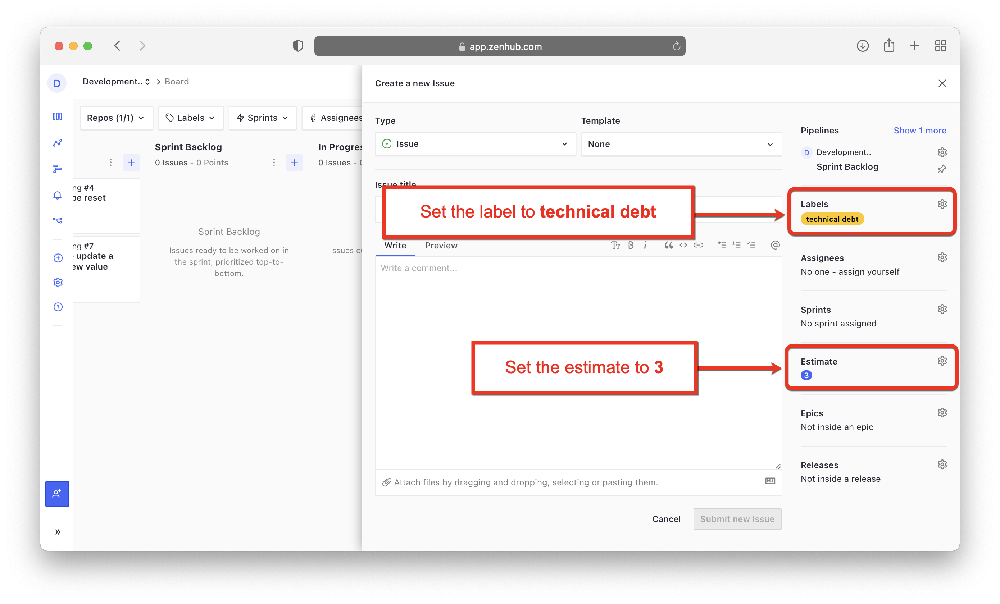
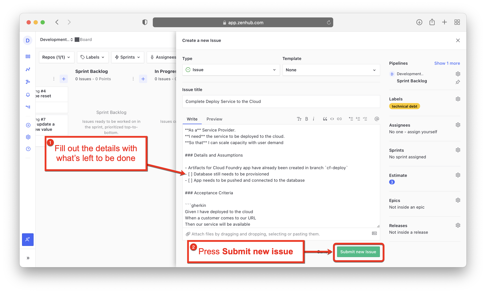
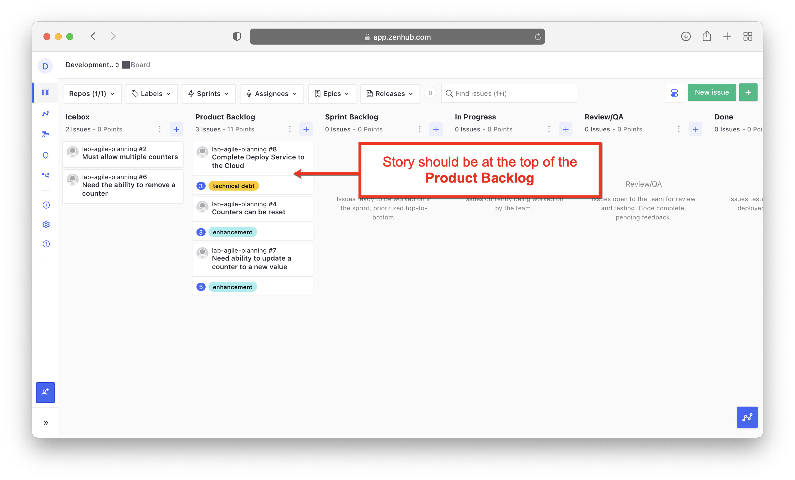

# Lab 8: End of Sprint Activities

**Estimated time needed:** 10 minutes

In this lab, you will close out the current sprint by moving done stories to closed, dealing with unfinished stories. 

## Objectives

After completing this lab, you will be able to:

1. Determine which stories to close complete a sprint.
1. Deal with unfinished work.

---

## Exercise 1 : Move Done stories to Closed

In this exercise, you will move all of the done stories that the product owner has deemed completed at the sprint review to the Closed pipeline.

1. Go to [app.zenhub.com](http://app.zenhub.com) and sign in with your GitHub account and bring up your kanban board.
    

1. At the sprint review meeting, the product owner agreed that all of the stories that we demonstrated meet the definition of done, per the **Acceptance Criteria** in the **Issue** and can now be closed. Move all of the stories from the **Done** pipeline to the **Closed** pipeline.
    

At the end of this exercise, your kanban board should look like this:
    

---

## Exercise 2 : Deal wth unfinished work

In this exercise, you will deal with the unfinished stories in the sprint. These are stories that the team has started, but not completed. We want to adjust the estimate to take credit for the story points expended so that it is reflected in the teams velocity, and create a new story to finish the work in the next sprint.

1. Select the story "*Deploy service to the cloud*" in the **In Progress** pipeline to open it.
    

1. Click the **Gear** next to **Estimate** to open the dropdown.
    

1. The developer has determined that they did not expend **5** story points of effort on this story and just ran out of time. They estimated that **2** story points were expended. Select **2** from the dropdown list to change the story points to **2**.
    

1. We can see that the story points are now set to **2**. Click the **X** to close the window.
    

1. Now the story points have been adjusted to reflect the effort that was made in this sprint. Move this story to the **Closed** pipeline.
    

1. We want to create a new story to document the remaining work. Press the **New Issue** button.
    

1. Since we know this new issue is going into the **Product Backlog** pipeline, click the gear icon next to **Pipelines** to open the dropdown list.
    

1. Select **Product Backlog** from the dropdown list.
    

1. Set the **Estimate** to **3**, which represents the remaining story points from the unfinished story. Set the label to `technical debt`, just like the original story.
    

1. Fill in the new issue with the remaining details to complete the story. (*Hint: You may want to copy and paste some details from the unfinished story as a starting point*.) When completed, press the **Submit new Issue** button.
    

1. Be sure the story is at the top of the **Product Backlog** pipeline to be selected for the next sprint.

Congratulations! You can completed all of the end of sprint activities.

## Summary

You learned how to conduct the activities required to close out a sprint. You moved done stories to closed, adjusted unfinished stories to reflect the true effort, and created new stories to document the remaining work. ZenHub will automatically close the sprint when it's end date has expired so there is nothing for you to do there. *Bonus: After the end of sprint date is passed, you might want to go back and look at your Velocity chart under Reports to see the teams velocity reflected in the chart*.
