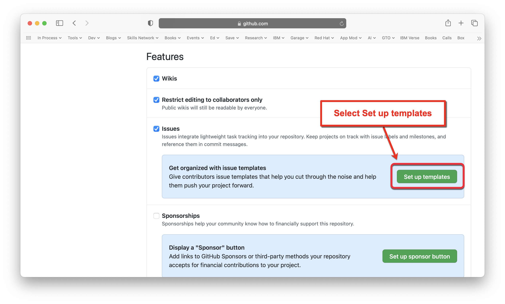
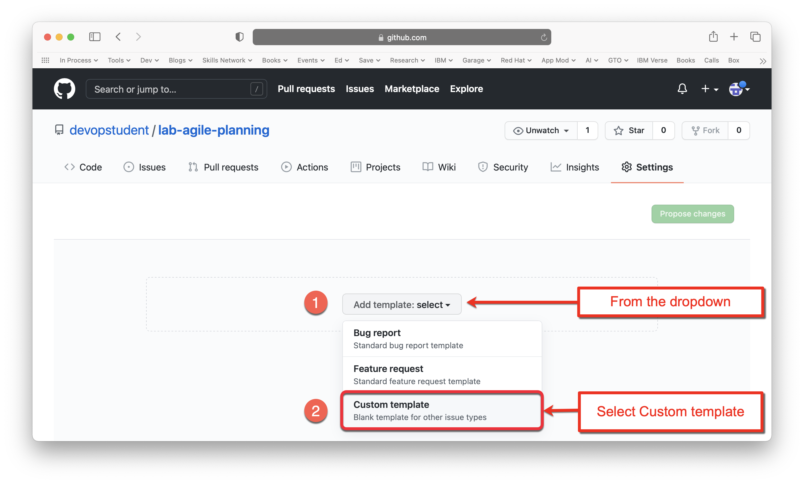
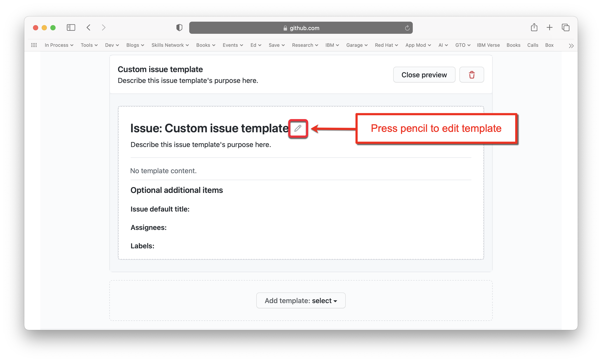
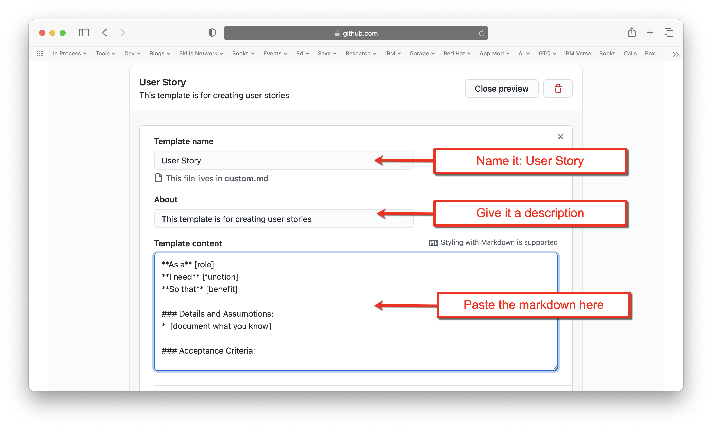
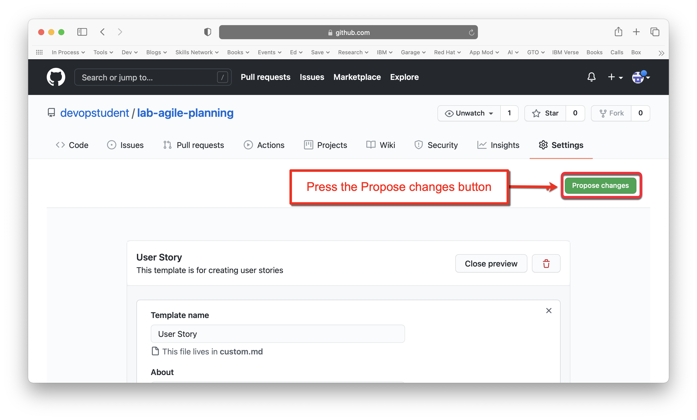
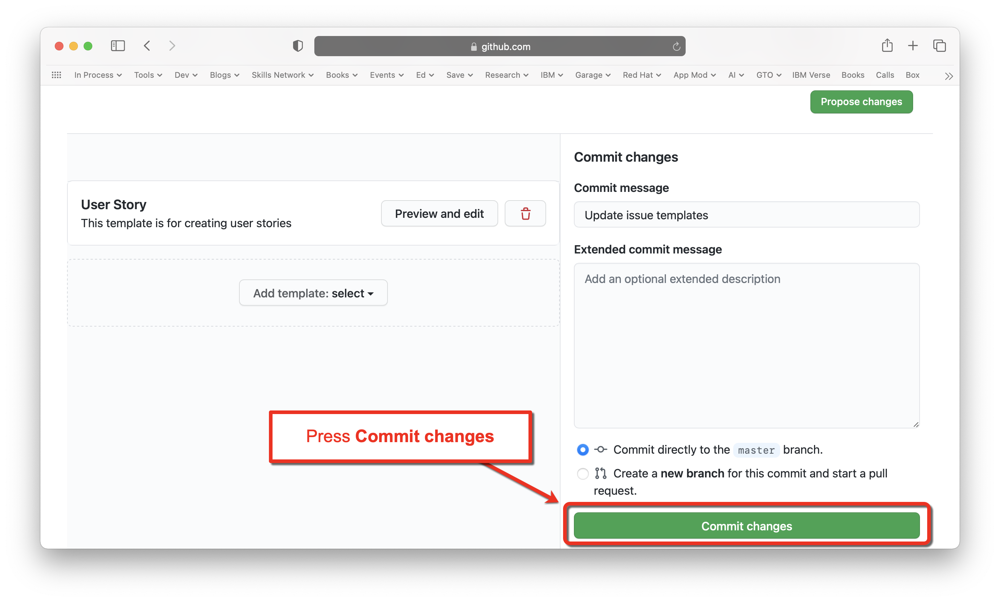
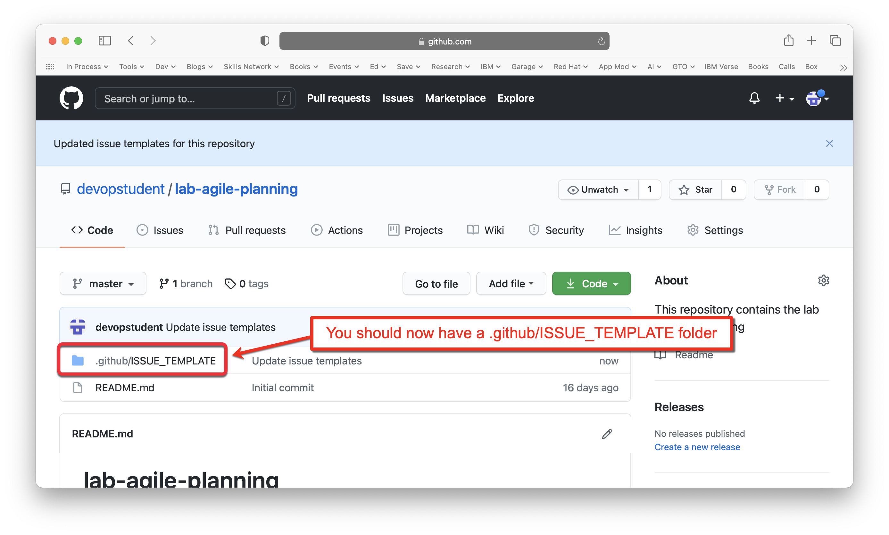

# Lab 2: Create an issue template in GitHub

**Estimated time needed:** 10 minutes

In this lab, you will create an issue template in GitHub that will help you to write well-formatted user stories in ZenHub.

## Objectives

After completing this lab, you will be able to:

1. Create an issue template in GitHub that contains the information required for writing good user stories.

## Exercise 1 : Create an issue template in GitHub

In this exercise, you will create an issue template in GitHub. This only needs to be done once for each new repository that you create.

1. Go to [GitHub.com](http://github.com) and select the `lab-agile-planning` repository that you created in [Lab 1](./lab01-get-set-up-in-zenhub.md).
    .

1. From the repository page, select **Settings**.
    

1. Scroll down to the **Features** section and select **Set up templates**.
    

1. From the dropdown list labeled **Add template** (1), select **Custom template** (2).
    

1. Next to the **Custom issue template** entry, press the **Preview and edit** button.
    

1. Press the **pencil** icon to edit the template.
    

1. Copy the following markdown for the story template content:
    <pre>
    **As a** [role]  
    **I need** [function]  
    **So that** [benefit]  
      
    ### Details and Assumptions
    * [document what you know]
      
    ### Acceptance Criteria  
      
    ```gherkin
    Given [some context]
    When [certain action is taken]
    Then [the outcome of action is observed]
    ```</pre>

1. Edit the **Template name** to be: `User Story`, give it an appropriate **description**, and paste the contents of the above markdown into the **Template content**
    

1. Scroll to the top of the page and press the **Propose changes** button.
    

1. Press the **Commit changes** button to commit the change to your repository.
    .

1. You should now have a new folder in your repository called `.github/ISSUE_TEMPLATES`, which will contain your new user story template.
    .

## Summary

You now have an issue template that you can use for all of your GitHub repositories that you need to write stories for to use in ZenHub. When we create issues in future labs, this template will guide you through what information is needed to create your user story.
