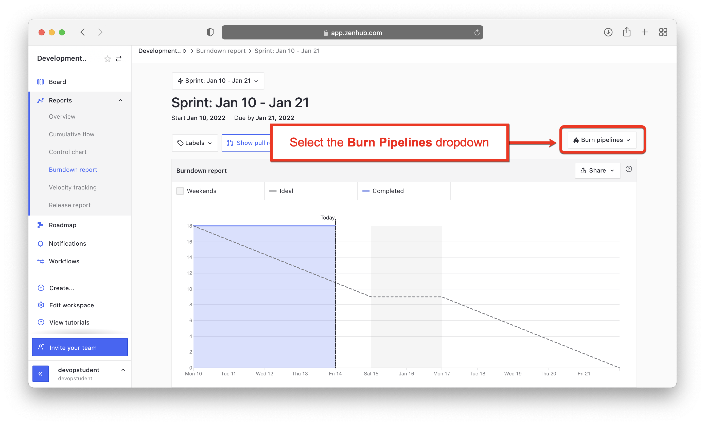

# Lab 7: Setup a Burndown Chart for Your Plan

**Estimated time needed:** 10 minutes

In this lab, you will set up a burndown chart for your plan. In most cases, the burndown chart is created automatically by ZenHub if you have set the start and end dates of your sprint correctly. There is still some setup to do to customize it to show stories that are done, but not closed. These changes are not permanent and will need to be made whenever you view your burndown charts.

## Objectives

After completing this lab, you will be able to:

1. Understand how to set up your burndown chart.
1. See the data that is contained in a burndown chart.
1. Judge your progress in the sprint.

---

## Exercise 1 : Set up your burndown chart

In this exercise, you will set up your burndown chart to show the status of the **Done** pipeline stories instead of the default **Closed** stories.

Since a burndown chart shows the story points completed vs. the time left in a sprint, it will be difficult to simulate in a one-day lab. Hopefully, you created a sprint that included the date that you performed the previous lab on the topic of daily execution. For best results, it is recommended that you wait a few days after that lab before performing this lab so that the passage of time will be reflected on the burndown chart.

1. Go to [app.zenhub.com](http://app.zenhub.com) and sign in with your GitHub account. Bring up your kanban board and click the **>>** icon in the lower left-hand corner to open the side menu bar.
    

1. From the side menu bar, select **Reports**.
    

1. From the reports menu, select **Burndown Report**.
    

1. Make sure the current sprint is selected. You can change the sprint using the dropdown list. Since we only have one sprint, the current sprint should already be selected.
    

1. Notice that the burndown chart isn't burning down. We just have a straight line across the top. This is because, by default, the burndown measures closed stories. Since we want to keep our stories in the **Done** pipeline before the sprint review, select the **Burn Pipelines** dropdown to change this behavior.
    

1. From the **Burn Pipelines** drop down, select **Done** to show the status of the stories that are done.
    

1. You can now see the status of the sprint in the burndown chart. Since you completed your stories in a single lab, there is one big drop in the progress. Normally this would be more gradual. Notice that we are well below the dotted line, which is a projection of where we should be at this time.
    

1. If you hover, using your mouse, over any of the blue dots on the burndown line, you will see a pop-up with the stories that contributed to that event. These are the stories that you moved to **Done** in the previous lab.
    

1. If you scroll down, you will see one status bar for the number of story points completed and remaining in the sprint, and another status bar showing the number of issues and pull requests completed and remaining. This gives a nice visual indicator of how far along you are. Below the status bars you will see the detailed status of all of the stories in your sprint. The detailed status lets you quickly see which stories are completed and which still need work.
    

## Summary

You learned how to set up a burndown chart to show the status of the done stories in your sprint. You also learned how to use the progress bars to get a visual status of where you are in the sprint, and see the status of individual stories. This information should help you get a good sense of how the work is progressing.
